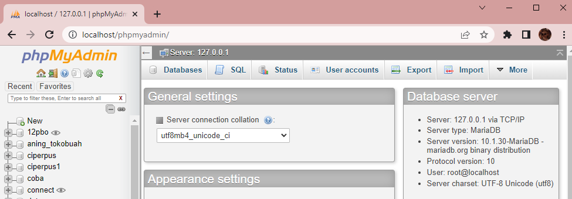
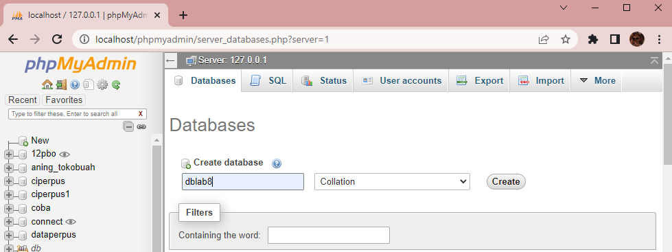
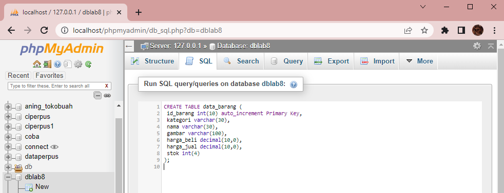
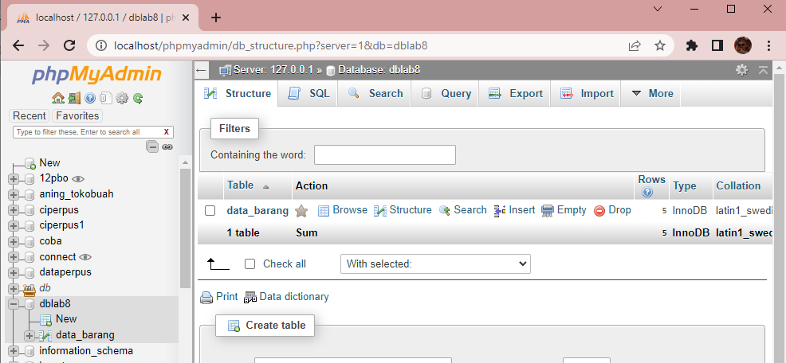
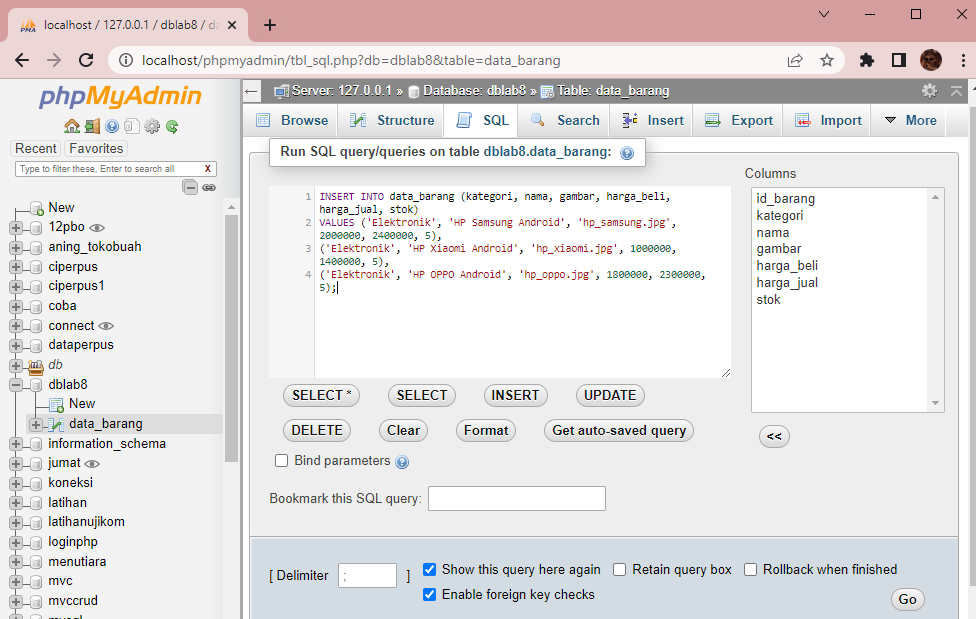
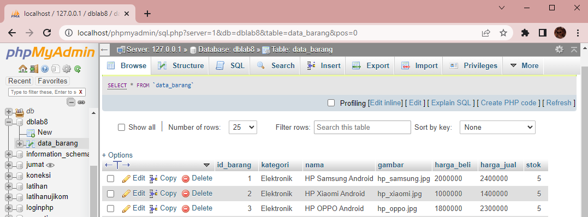
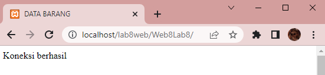
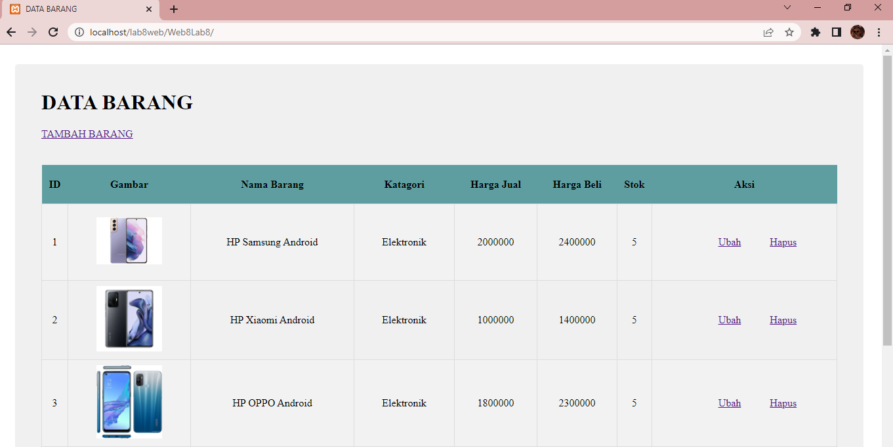
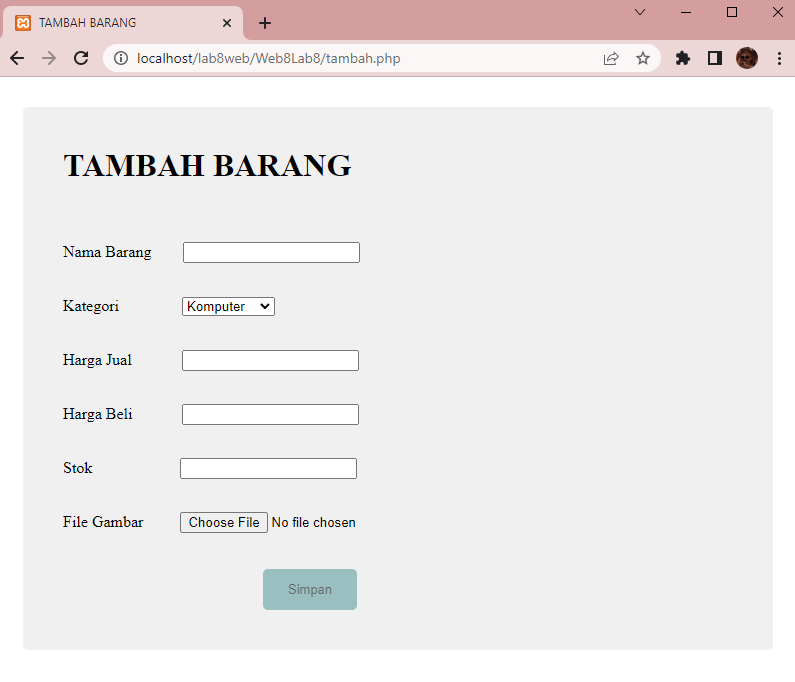
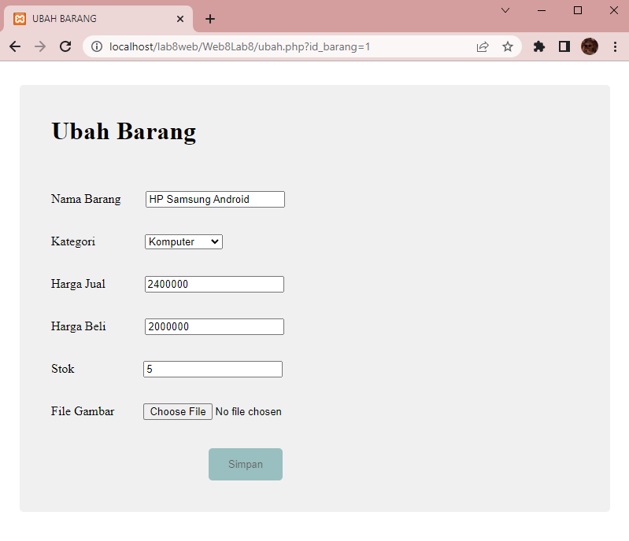

# Web8Lab8

**Nama    : Aning Kinanti** <br>
**NIM     : 312010364** <br>
**Kelas   : TI.20.A2** <br>
**Matkul  : Pemrograman Web** <br>

# Belajar PHP dan Database MySQL
1. Pastikan Xampp sudah terinstall dan server dapat berjalan dengan baik http://127.0.0.1 atau http://localhost
2. Tempatkan file website tempatkan di direktori: \xampp\htdocs\

## A. Database MySQL
### 1. Membuat Database
Akses link http://localhost/phpmyadmin/ lalu akan muncul tampilan seperti dibawah ini : <br>
 <br>

Selanjutnya klik tanda tambah (new) untuk membuat database. <br>
Buat database dengan nama `dblab8` lalu klik create seperti contoh dibawah ini : <br>
 <br>

### 2. Membuat Table
Buka database yang telah dibuat sebelumnya, lalu klik tanda tanda tambah (new) untuk membuat table. <br>
Pilih SQL pada menu bar lalu ketik semua sintaks kemudian pilih go seperti contoh dibawah ini : <br>
 <br>

Maka table yang telah dibuat akan muncul seperti gambar dibawah ini : <br>
 <br>

### 3. Insert Data pada Table
Buka table yang telah dibuat sebelumnya, lalu pilih SQL pada menubar. <br>
Selanjutnya pilih insert, ketik semua sintaks lalu pilih go seperti pada contoh dibawah ini : <br>
 <br>

Maka data yang telah di insert akan muncul pada table seperti gambar dibawah ini : <br>
 <br>

## B. Program CRUD
Buat folder lab8web pada root directory web server (d:\xampp\htdocs) <br>
Kemudian untuk mengakses direktory tersebut pada web server dengan mengakses URL: <br>
http://localhost/lab8web/

### 1. Membuat File Koneksi Database
Buatlah file baru dengan nama `koneksi.php`, lalu isi dengan sintaks seperti contoh dibawah ini : <br>
```
<?php
    $host = "localhost";
    $user = "root";
    $pass = "";
    $db = "dblab8";

    $conn = mysqli_connect($host, $user, $pass, $db);
    if ($conn == false)
    {
        echo "Koneksi ke server gagal.";
        die();
    }  #else echo "Koneksi berhasil";
?>
```
<br>

Kemudian untuk mengakses hasilnya melalui URL: http://localhost/lab8web/Web8Lab8 <br>
Buka melalui browser untuk menguji koneksi database (untuk menyampilkan pesan 
koneksi berhasil. <br>
 <br>

### 2. Membuat File Index php
Buatlah file baru dengan nama `index.php`, lalu isi dengan sintaks seperti contoh dibawah ini : <br>
```
<?php
    include("koneksi.php");
    // query untuk menampilkan data
    $sql = 'SELECT * FROM data_barang';
    $result = mysqli_query($conn, $sql);
?>

<!DOCTYPE html>
<html lang="en">
<head>
    <meta charset="UTF-8">
    <meta http-equiv="X-UA-Compatible" content="IE=edge">
    <meta name="viewport" content="width=device-width, initial-scale=1.0">
    <link href="style_index.css" rel="stylesheet" type="text/css" />
    <title>DATA BARANG</title>
</head>
<body>
    <div class="container">
        <h1>DATA BARANG</h1>
        <div>
        <a href="tambah.php">TAMBAH BARANG</a>
        </div>
        <br>
        <div class="main">
            <table>
            <tr>
                <th>ID</th>
                <th>Gambar</th>
                <th>Nama Barang</th>
                <th>Katagori</th>
                <th>Harga Jual</th>
                <th>Harga Beli</th>
                <th>Stok</th>
                <th>Aksi</th>
            </tr>
            <?php if($result): ?>
            <?php while($row = mysqli_fetch_array($result)): ?>
            <tr>
                <td><?= $row['id_barang'];?></td>
                <td>" alt="<?= $row['nama']; ?>" width="100"></td>
                <td><?= $row['nama'];?></td>
                <td><?= $row['kategori'];?></td>
                <td><?= $row['harga_beli'];?></td>
                <td><?= $row['harga_jual'];?></td>
                <td><?= $row['stok'];?></td>
                <td>
                    <a class="ubah" href="ubah.php?id_barang=<?php echo $row['id_barang']; ?>">Ubah</a>
                    <a class="hapus" href="hapus.php?id_barang=<?php echo $row['id_barang']; ?>">Hapus</a>
                </td>
            </tr>
            <?php endwhile; else: ?>
            <tr>
                <td colspan="7">Belum ada data</td>
            </tr>
            <?php endif; ?>
            </table>
        </div>
    </div>
</body>
</html>
```
<br>

Kemudian buatlah file css dengan nama `style_index.css`, untuk membuat tampilan lebih rapih. <br>
Lalu isi dengan sintaks seperti contoh dibawah ini : <br>
```
.container {
    margin: 30px 20px;
    background-color: #f0f0f0;
    font-family: "Times New Roman", Times, serif;
    border-radius: 5px;
    border-collapse: collapse;
}

h1 {
    padding-top: 40px;
    padding-left: 40px;
}

a {
    padding-left: 40px;
}

.main {
    padding-left: 40px;
    padding-top: 20px;
    padding-bottom: 40px;
    padding-right: 40px;
}

table {
    width: 100%;
    border-radius: 5px;
    font-family: "Times New Roman", Times, serif;
    border-collapse: collapse;
}
  
th {
    height: 35px;
    text-align: center;  
    padding-top: 12px;
    padding-bottom: 12px;
    background-color: #5f9ea0;
    color: black;
}

td {
    height: 100px;
    text-align: center;
    border: 1px solid #ddd;
    padding: 8px;
}

tr:nth-child(even){background-color: #f2f2f2;}
tr:hover {background-color: #ddd;}
```
<br>


Kemudian refresh halaman web, maka hasilnya akan menjadi seperti dibawah ini :<br>
 <br>

### 3. Membuat File Tambah php (Create)
Buatlah file baru dengan nama `tambah.php`, lalu isi dengan sintaks seperti contoh dibawah ini : <br>
```
<?php
error_reporting(E_ALL);
include_once 'koneksi.php';
if (isset($_POST['submit'])) {
  $nama = $_POST['nama'];
  $kategori = $_POST['kategori'];
  $harga_jual = $_POST['harga_jual'];
  $harga_beli = $_POST['harga_beli'];
  $stok = $_POST['stok'];
  $file_gambar = $_FILES['file_gambar'];
  $gambar = null;
  if ($file_gambar['error'] == 0) {
    $filename = str_replace(' ', '_', $file_gambar['name']);
    $destination = dirname(__FILE__) . '/gambar/' . $filename;
    if (move_uploaded_file($file_gambar['tmp_name'], $destination)) {
      $gambar =  $filename;;
    }
  }
  $sql = 'INSERT INTO data_barang (nama, kategori,harga_jual, harga_beli, stok, gambar) ';
  $sql .= "VALUE ('{$nama}', '{$kategori}','{$harga_jual}', '{$harga_beli}', '{$stok}', '{$gambar}')";
  $result = mysqli_query($conn, $sql);
  
  header('location: index.php');
}
?>

<!DOCTYPE html>
<html lang="en">
<head>
    <meta charset="UTF-8">
    <meta http-equiv="X-UA-Compatible" content="IE=edge">
    <meta name="viewport" content="width=device-width, initial-scale=1.0">
    <link href="style_tambah.css" rel="stylesheet" type="text/css" />
    <title>TAMBAH BARANG</title>
</head>
<body>
    <div class="container">
        <h1>TAMBAH BARANG</h1>
        <div class="main">
            <form method="post" action="tambah.php" enctype="multipart/form-data">
                <div class="input">
                    <label>Nama Barang</label>
                    <input class="nama" type="text" name="nama"/>
                </div>
                <div class="input">
                    <label>Kategori</label>
                    <select class="kategori" name="kategori">
                        <option value="Komputer">Komputer</option>
                        <option value="Elektronik">Elektronik</option>
                        <option value="Handphone">Handphone</option>
                    </select>
                </div>
                <div class="input">
                    <label>Harga Jual</label>
                    <input class="harga_jual" type="text" name="harga_jual"/>
                </div>
                <div class="input">
                    <label>Harga Beli</label>
                    <input class="harga_beli" type="text" name="harga_beli"/>
                </div>
                <div class="input">
                    <label>Stok</label>
                    <input class="stok" type="text" name="stok"/>
                </div>
                <div class="input">
                    <label>File Gambar</label>
                    <input class="file" type="file" name="file_gambar"/>
                </div>
                <div class="submit">
                    <input class="button" type="submit" name="submit" value="Simpan"/>
                </div>
            </form>
        </div>
    </div> 
</body>
</html>
```
<br>

Kemudian buatlah file css dengan nama `style_tambah.css`, untuk membuat tampilan lebih rapih. <br>
Lalu isi dengan sintaks seperti contoh dibawah ini : <br>
```
.container {
    margin: 30px 20px;
    background-color: #f0f0f0;
    font-family: "Times New Roman", Times, serif;
    border-radius: 5px;
}

h1 {
    padding-top: 40px;
    padding-left: 40px;
}

.main {
    padding-left: 40px;
    padding-top: 10px;
    padding-bottom: 40px;
    padding-right: 40px;
}

.input {
    padding-top: 20px;
}

.nama {
    margin-left: 20px;
}

.kategori {
    margin-left: 51px;
}

.harga_jual {
    margin-left: 38px;
}

.harga_beli {
    margin-left: 38px;
}

.stok {
    margin-left: 76px;
}

.file {
    margin-left: 25px;
}

.submit {
    padding-top: 30px;
}

label {
    padding: 8px 8px 8px 0;
    display: inline-block;
  }

.button {
    background-color: #5f9ea0;
    border-radius: 5px;
    color: black;
    border: none;
    padding: 13px 25px;
    text-align: center;
    font-size: 13px;
    margin-left: 200px;
    opacity: 0.6;
    transition: 0.3s;
    display: inline-block;
    text-decoration: none;
    cursor: pointer;
}

.button:hover {opacity: 1}
```
<br>

Kemudian refresh halaman web, maka hasilnya akan menjadi seperti dibawah ini :<br>
 <br>

### 4. Membuat File Ubah php (Update)
Buatlah file baru dengan nama `ubah.php`, lalu isi dengan sintaks seperti contoh dibawah ini : <br>
```
<?php
    error_reporting(E_ALL);
    include_once 'koneksi.php';

    if (isset($_POST['submit']))
    {
        $id = $_POST['id'];
        $nama = $_POST['nama'];
        $kategori = $_POST['kategori'];
        $harga_jual = $_POST['harga_jual'];
        $harga_beli = $_POST['harga_beli'];
        $stok = $_POST['stok'];
        $file_gambar = $_FILES['file_gambar'];
        $gambar = null;
    
        if ($file_gambar['error'] == 0)
        {
            $filename = str_replace(' ', '_', $file_gambar['name']);
            $destination = dirname(__FILE__) . '/gambar/' . $filename;
            if (move_uploaded_file($file_gambar['tmp_name'], $destination))
            {
            $gambar = 'gambar/' . $filename;;
            }
        }
        $sql = 'UPDATE data_barang SET ';
        $sql .= "nama = '{$nama}', kategori = '{$kategori}', ";
        $sql .= "harga_jual = '{$harga_jual}', harga_beli = '{$harga_beli}', stok = '{$stok}' ";

        if (!empty($gambar))

        $sql .= ", gambar = '{$gambar}' ";
        $sql .= "WHERE id_barang = '{$id}'";
        $result = mysqli_query($conn, $sql);

        header('location: index.php');
    }
    $id_barang = $_GET['id_barang'];
    $sql = "SELECT * FROM data_barang WHERE id_barang = '{$id_barang}'";
    $result = mysqli_query($conn, $sql);
    if (!$result) die('Error: Data tidak tersedia');
    $data = mysqli_fetch_array($result);

    function is_select($var, $val) {
        if ($var == $val) return 'selected="selected"';
        return false;
    }
?>

<!DOCTYPE html>
<html lang="en">
<head>
    <meta charset="UTF-8">
    <meta http-equiv="X-UA-Compatible" content="IE=edge">
    <meta name="viewport" content="width=device-width, initial-scale=1.0">
    <link href="style_ubah.css" rel="stylesheet" type="text/css" />
    <title>UBAH BARANG</title>
</head>
<body>
    <div class="container">
        <h1>Ubah Barang</h1>
        <div class="main">
            <form method="post" action="ubah.php" enctype="multipart/form-data">
                <div class="input">
                    <label>Nama Barang</label>
                    <input class="nama" type="text" name="nama" value="<?php echo $data['nama'];?>" />
                </div>
                <div class="input">
                    <label>Kategori</label>
                    <select name="kategori" class="kategori">
                        <option <?php echo is_select('Komputer', $data['kategori']);?> value="Komputer">Komputer</option>
                        <option <?php echo is_select('Komputer', $data['kategori']);?> value="Elektronik">Elektronik</option>
                        <option <?php echo is_select('Komputer', $data['kategori']);?> value="Hand Phone">Hand Phone</option>
                    </select>
                </div>
                <div class="input">
                    <label>Harga Jual</label>
                    <input class="harga_jual" type="text" name="harga_jual" value="<?php echo $data['harga_jual'];?>" />
                </div>
                <div class="input">
                    <label>Harga Beli</label>
                    <input class="harga_beli" type="text" name="harga_beli" value="<?php echo $data['harga_beli'];?>" />
                </div>
                <div class="input">
                    <label>Stok</label>
                    <input class="stok" type="text" name="stok" value="<?php echo $data['stok'];?>" />
                </div>
                <div class="input">
                    <label>File Gambar</label>
                    <input class="file" type="file" name="file_gambar" />
                </div>
                <div class="submit">
                <input type="hidden" name="id" value="<?php echo $data['id_barang'];?>" />
                    <input class="button" type="submit" name="submit" value="Simpan" />
                </div>
            </form>
        </div>
    </div>
</body>
</html>
```
<br>

Kemudian buatlah file css dengan nama `style_ubah.css`, untuk membuat tampilan lebih rapih. <br>
Lalu isi dengan sintaks seperti contoh dibawah ini : <br>
```
.container {
    margin: 30px 20px;
    background-color: #f0f0f0;
    font-family: "Times New Roman", Times, serif;
    border-radius: 5px;
}

h1 {
    padding-top: 40px;
    padding-left: 40px;
}

.main {
    padding-left: 40px;
    padding-top: 10px;
    padding-bottom: 40px;
    padding-right: 40px;
}

.input {
    padding-top: 20px;
}

.nama {
    margin-left: 20px;
}

.kategori {
    margin-left: 51px;
}

.harga_jual {
    margin-left: 38px;
}

.harga_beli {
    margin-left: 38px;
}

.stok {
    margin-left: 76px;
}

.file {
    margin-left: 25px;
}

.submit {
    padding-top: 30px;
}

label {
    padding: 8px 8px 8px 0;
    display: inline-block;
  }

.button {
    background-color: #5f9ea0;
    border-radius: 5px;
    color: black;
    border: none;
    padding: 13px 25px;
    text-align: center;
    font-size: 13px;
    margin-left: 200px;
    opacity: 0.6;
    transition: 0.3s;
    display: inline-block;
    text-decoration: none;
    cursor: pointer;
}

.button:hover {opacity: 1}
```
<br>


Kemudian refresh halaman web, maka hasilnya akan menjadi seperti dibawah ini :<br>
 <br>

### 5. Membuat File Hapus php (Delete)
Buatlah file baru dengan nama `hapus.php`, lalu isi dengan sintaks seperti contoh dibawah ini : <br>
```
<?php
    include_once 'koneksi.php';
    $id = $_GET['id_barang'];
    $sql = "DELETE FROM data_barang WHERE id_barang = '{$id}'";
    $result = mysqli_query($conn, $sql);
    header('location: index.php');
?>
```
<br>
